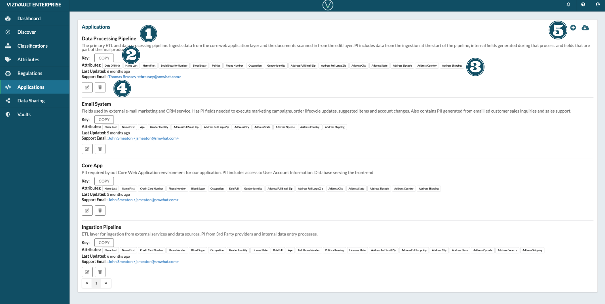

# Applications

1. **Name and Description**: The unique name of the application that will access data form the vault and a description describing the purpsoe of the application and how retrieved data will be used.
2. **Key**: The public encryption key associated with the application
3. **Attributes, Last Updated, Support Email**
   1. Attributes: THe attribute data types the application has permission to access.
   2. Last Updated: The last time the properties of the application was updated.
   3. Support Email: The email address of the system support expert.
4. **Actions**: Actions that you can take on an application.

&nbsp;&nbsp;&nbsp;&nbsp;

&nbsp;&nbsp;&nbsp;&nbsp;&nbsp;Edit the properties of an application.

&nbsp;&nbsp;&nbsp;&nbsp;

&nbsp;&nbsp;&nbsp;&nbsp;&nbsp;Delete the application.

&nbsp;&nbsp;&nbsp;&nbsp;

&nbsp;&nbsp;&nbsp;&nbsp;&nbsp;Add a new application.

&nbsp;&nbsp;&nbsp;&nbsp;

&nbsp;&nbsp;&nbsp;&nbsp;&nbsp;Export data on existing applications.
