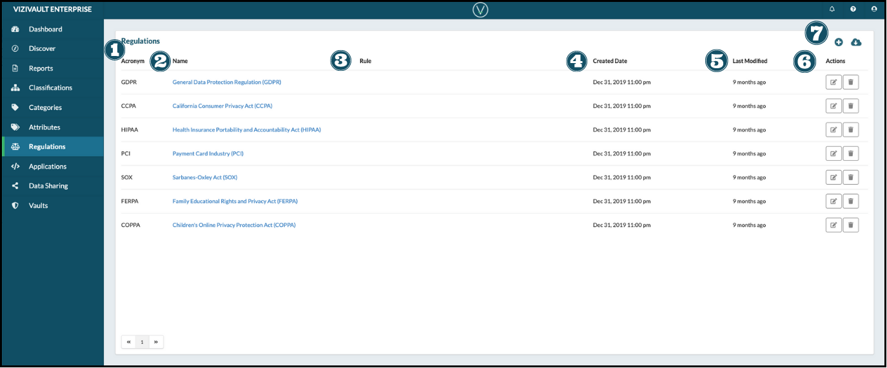

# Regulations

1. **Acronym**: Unique short abbreviation of full regulation name.
2. **Name**: Full name of the regulation, standard, or procedure.
3. **Rules**: Custom generated rule structure for the regulation.
4. **Created Date**: The date when the regulation was first introduced.
5. **Last Modified**:  The date when the regualation was last changed.
6. **Actions**: Actions that you can take on an attribute.

&nbsp;&nbsp;&nbsp;&nbsp;

&nbsp;&nbsp;&nbsp;&nbsp;&nbsp;Edit the properties of a regulation.

&nbsp;&nbsp;&nbsp;&nbsp;

&nbsp;&nbsp;&nbsp;&nbsp;&nbsp;Delete the regulation

7. **Creation and Export**: Add a new attribute ot export the existing attributes.

&nbsp;&nbsp;&nbsp;&nbsp;

&nbsp;&nbsp;&nbsp;&nbsp;&nbsp;Add a new regulation.

&nbsp;&nbsp;&nbsp;&nbsp;

&nbsp;&nbsp;&nbsp;&nbsp;&nbsp;Export existing regulations.
