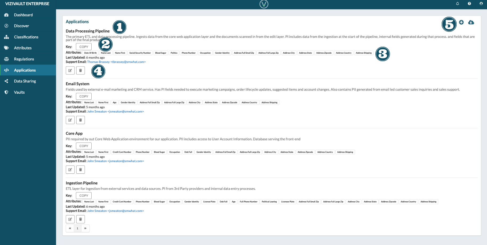
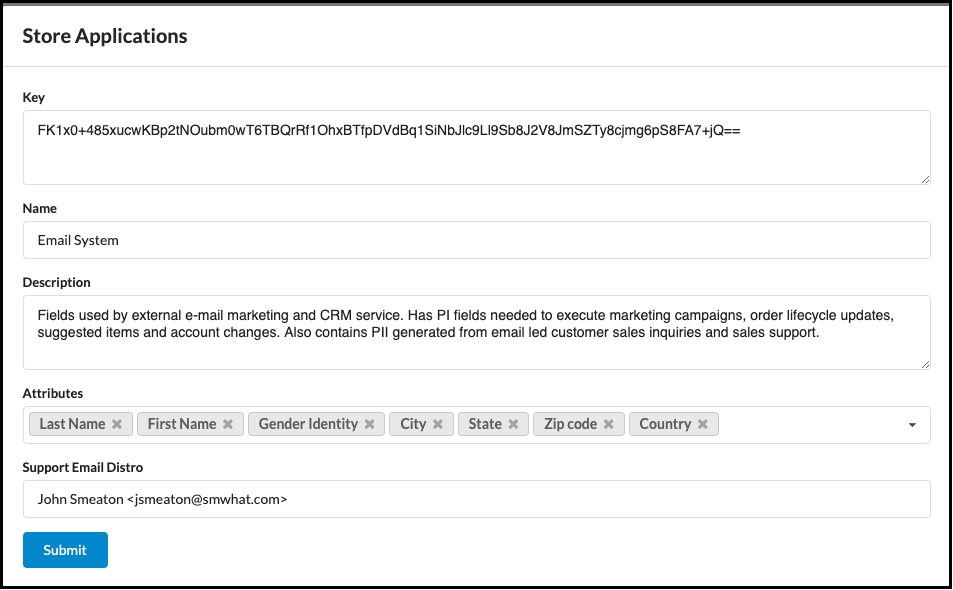
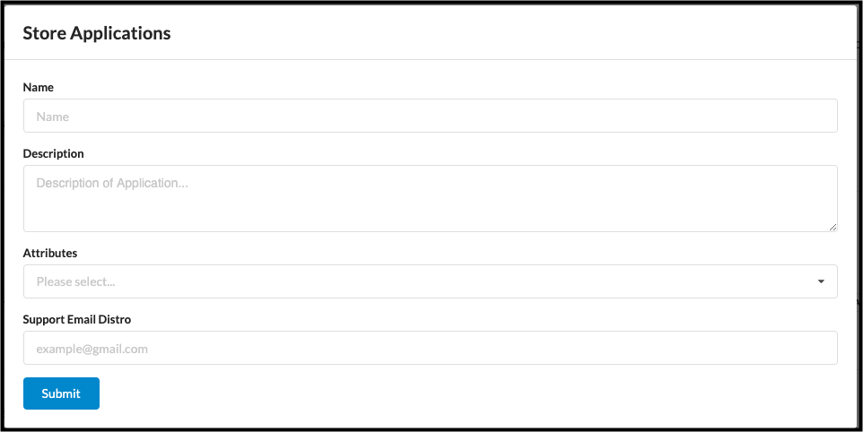

# Applications

1. **Name and Description**: The unique name of the application that will access data form the vault and a description describing the purpsoe of the application and how retrieved data will be used.
2. **Key**: The public encryption key associated with the application
3. **Attributes, Last Updated, Support Email**
    - Attributes: THe attribute data types the application has permission to access.
    - Last Updated: The last time the properties of the application was updated.
    - Support Email: The email address of the system support expert.
4. **Actions**: Actions that you can take on an application.
     **Edit the properties of an application**
    
     **Delete the application**
    
5. **Creation and Export**
     **Add a new Data Sharing Schedule**.
    
     **Export information on existing sharing schedules**.
