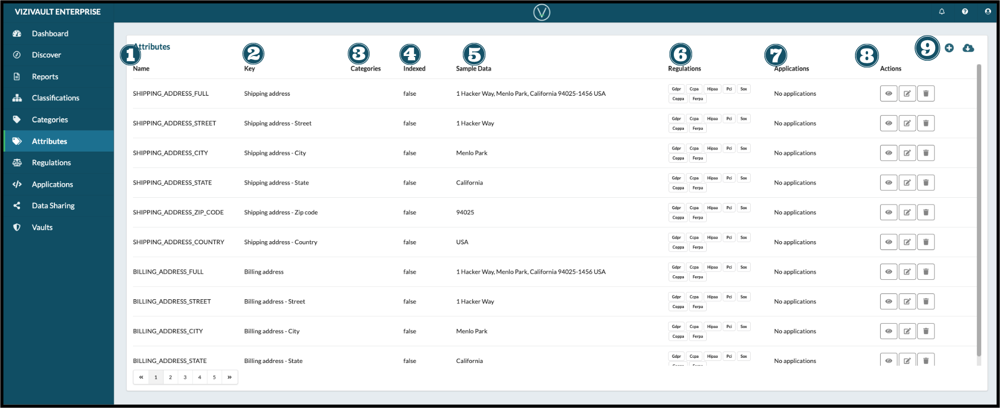

# Attributes

1. **Name**: The user-friendly non-unique attribute identifier
2. **Key**: THe unique identifier for an attribute for puropses of insertion and retrieval progmatically from a vault
3. **Categories**: The category tags that are applied to an attribute
4. **Indexed**: The index status of an attribute for return in searches across users
5. **Sample Data**: Sample faux data demonstrating the format of the attribute
6. **Regulations**: List of regulations that are considered to apply to the attribute
7. **Application**: THe applications that have access to an attribute
8. **Actions**: Actions that you can take on an attribute

&nbsp;&nbsp;&nbsp;&nbsp;

&nbsp;&nbsp;&nbsp;&nbsp;&nbsp;View the full properties of an attribute

&nbsp;&nbsp;&nbsp;&nbsp;

&nbsp;&nbsp;&nbsp;&nbsp;&nbsp;Edit the properties of an attribute

&nbsp;&nbsp;&nbsp;&nbsp;

&nbsp;&nbsp;&nbsp;&nbsp;&nbsp;Delete the attribute

9. **Creation and Export**: Add a new attribute ot export the existing attributes.

&nbsp;&nbsp;&nbsp;&nbsp;

&nbsp;&nbsp;&nbsp;&nbsp;&nbsp;Add a new attribute

&nbsp;&nbsp;&nbsp;&nbsp;

&nbsp;&nbsp;&nbsp;&nbsp;&nbsp;Export existing attributes
