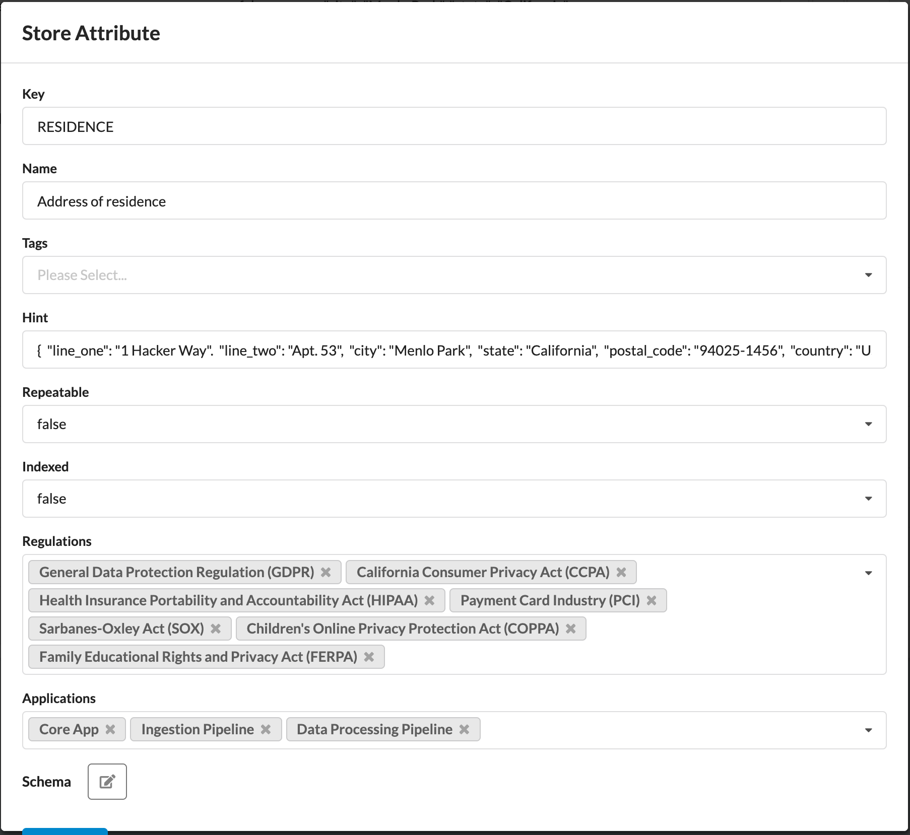
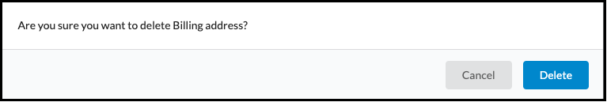
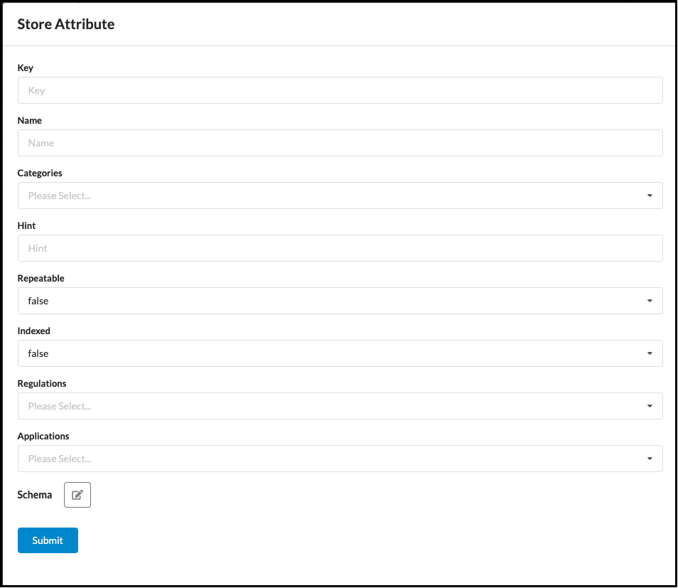

# Attributes

1. **Name**: The user-friendly non-unique attribute identifier.
2. **Key**: The unique identifier for an attribute for purposes of insertion and retrieval programmatically from a vault.
3. **Categories**: The category tags that are applied to an attribute.
4. **Indexed**: The index status of an attribute for return in searches across users.
5. **Sample Data**: Sample faux data demonstrating the format of the attribute.
6. **Regulations**: List of regulations that are considered to apply to the attribute.
7. **Application**: The applications that have access to an attribute.
8. **Actions**: Actions that you can take on an attribute.
  
&nbsp;&nbsp;&nbsp;&nbsp; **View the full properties of an attribute.**
  
&nbsp;&nbsp;&nbsp;&nbsp; **Edit the Properties of the Attribute**
  
  
&nbsp;&nbsp;&nbsp;&nbsp;&nbsp;
  
  
&nbsp;&nbsp;&nbsp;&nbsp; **Delete the attribute**.
  
  
&nbsp;&nbsp;&nbsp;&nbsp;&nbsp;
  
9. **Creation and Export**: Add a new attribute ot export the existing attributes
  
&nbsp;&nbsp;&nbsp;&nbsp; Add a new attribute.
  
  
&nbsp;&nbsp;&nbsp;&nbsp;
  
  
&nbsp;&nbsp;&nbsp;&nbsp; Export information on existing attributes.

