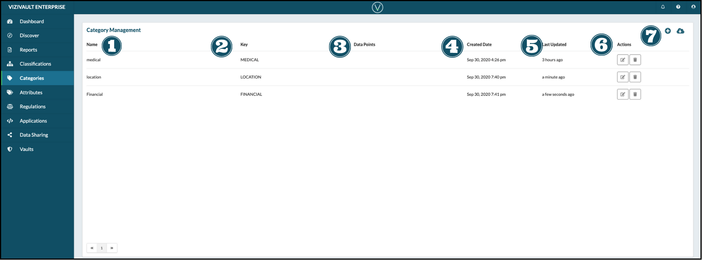

# Categories

1. **Name**: The user-friendly non-unique attribute identifier.
2. **Key**: The unique identifier for a category.
3. **Data Points**: The number of data points tagged with this category.
4. **Created Date**: Date when the category was created.
5. **Last Updated**: Date when the category was last updatede.
6. **Actions**: Actions that you can take on an attribute.

&nbsp;&nbsp;&nbsp;&nbsp;

&nbsp;&nbsp;&nbsp;&nbsp;&nbsp;Edit the properties of a catgeory.

&nbsp;&nbsp;&nbsp;&nbsp;

&nbsp;&nbsp;&nbsp;&nbsp;&nbsp;Delete the category.

7. **Creation and Export**: Add a new attribute ot export the existing attributes.

&nbsp;&nbsp;&nbsp;&nbsp;

&nbsp;&nbsp;&nbsp;&nbsp;&nbsp;Add a new category.

&nbsp;&nbsp;&nbsp;&nbsp;

&nbsp;&nbsp;&nbsp;&nbsp;&nbsp;Export information on existing categories.
