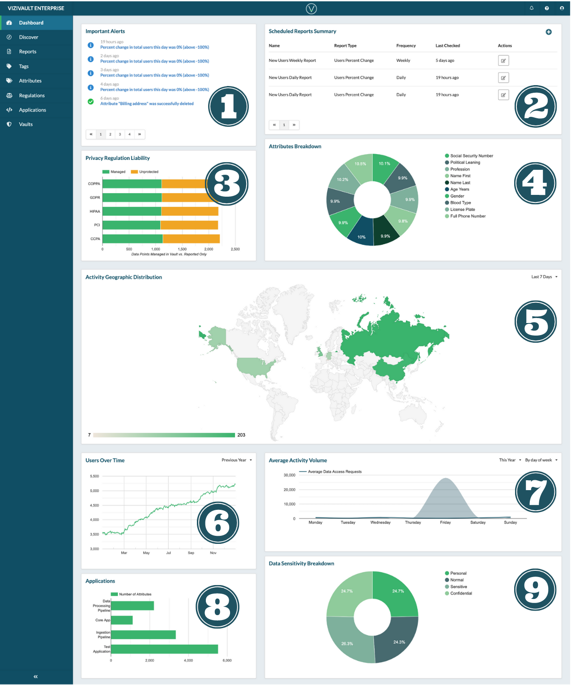

# Dashboard

  

1. Alerts and notifications indicating events that have happened recently in the system.
2. Status of scheduled reports.
3. Comparison of data that is secured in the vault versus data that the vault is reporting on, broken down by regulations.
4. Statistics on what attributes are stored in the vault
5. Breakdown of your private data access activity geographically over variable time periods.
6. Number of users represented in the system's data over a variable time period.
7. Volume of activity on the system by variable time periods
8. Data points on the system broken down by applications that use them.
9. Breakdown of data in the system by sensitivity rating (Personal/Normal/Confidential/Sensitive)

