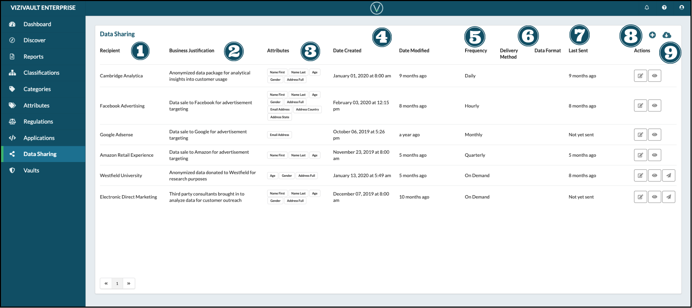
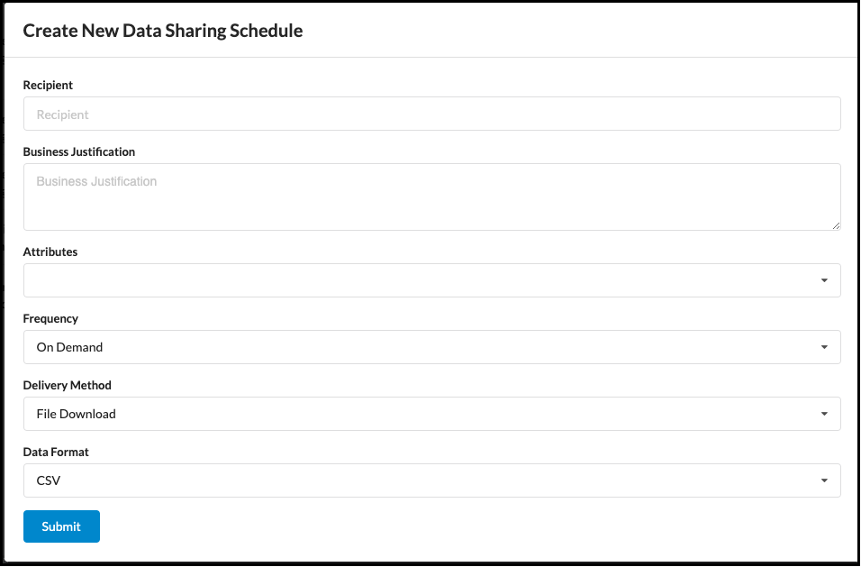

# Data Sharing

1. **Recipient**: The receiver of personal information from your organization.
2. **Business Justification**: The business need or requirement that this sharing operation fulfills.
3. **Attributes**: The attribute data types contained in the sharing export.
4. **Date Created/Date Modified**: The time this sharing schedule was created and the last time it was modified.
5. **Frequency**: The schedule of this sharing process execution (Hourly, Daily, Weekly, Monthly, Quarterly, Annual, and On Demand)
6. **Delivery Method**: How the data sharing export file will be delivered (API, EDI, Email, Secure File Download).
7. **Last Sent**: The last time this data export was sent.
8. **Creation and Export** 
     Add a new Data Sharing Schedule.
    
     Export information on existing sharing schedules.
9. **Actions**: Actions that you can take on a report. 
     Edit the properties of a Sharing Schedule.
    
     View Shared Data. 
     Manually Send the Data Export.
