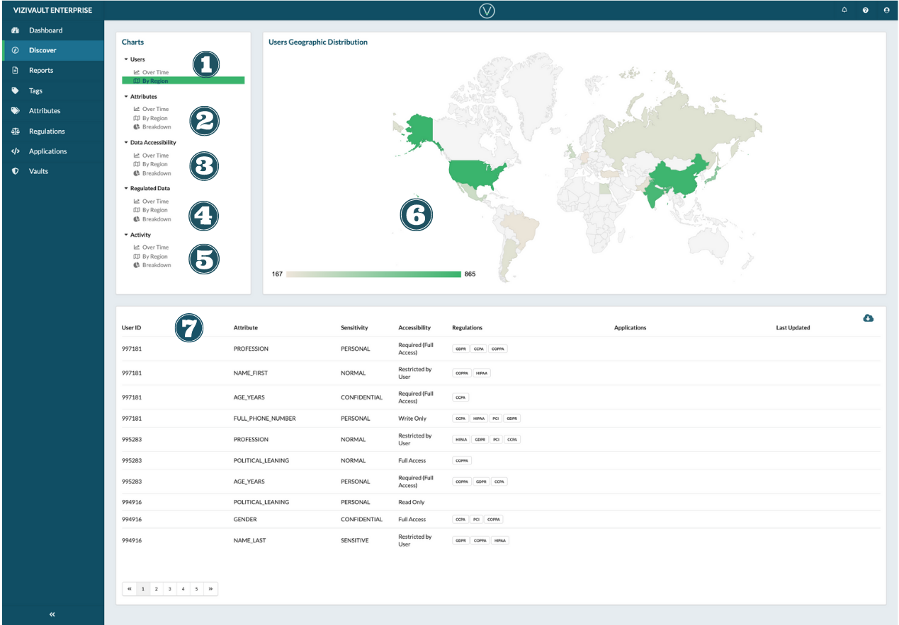

# Discover

The Discover page lets you browse the information and activities happening in your vault dynamically. This allows you to drill in on relevant subsets of information.

1. User counts segmented by time and/or region
2. Aggregate datapoint count split up by attribute data type. Examine totals by time, region, and overall breakdown.
3. Aggregate datapoint counts split up by data accessibility. Examine totals by time, region, and overall breakdown.
4. Aggregate datapoint counts split up by regulation. Examine totals by time, region, and overall breakdown.
5. Aggregate activity counts split up by application origin. Examine totals by time, region, and overall breakdown.
6. The chart generated by choosing a chart time window and segmentation above.
7. The dataset generated by choosing a chart time window and segmentation above.
