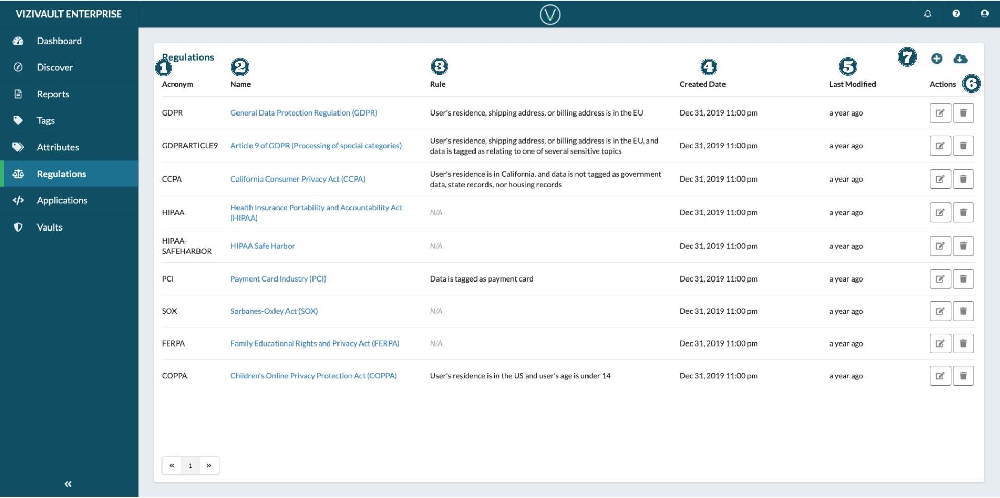

# Regulations

1. **Acronym**: Unique short abbreviation of full regulation name.
2. **Name**: Full name of the regulation, standard, or procedure.
3. **Rules**: Custom rule structure for the regulation.
4. **Created Date**: The date when the regulation was first introduced.
5. **Last Modified**:  The date when the regualation was last changed.
6. **Actions**: Actions that you can take on an attribute. 
     Edit the properties of a regulation. 
     Delete the regulation.
7. **Creation and Export**: Add a new attribute ot export the existing attributes. 
     Add a new regulation. 
     Export information on existing regulations.
