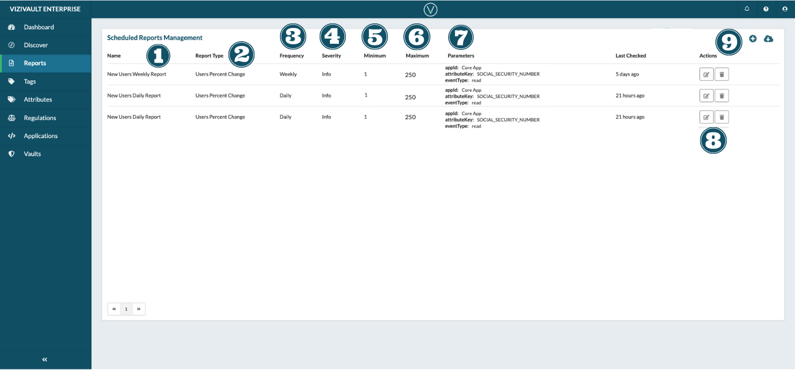

# Reports

1. **Name**: The unique identifier of the report.
2. **Report Type**: The activity measurement (User Percent Change/ Pxt Change in Activity Volume, Activity Volume).
3. **Frequency**: How frequently the report is run.
4. **Severity**: The level of severity of the Alert (Info/Neutral/Success/Warning/Danger)
5. **Minimum**: The minimum percentage or absolute number to trigger the alert
6. **Maximum**: The maximum percentage or absolute number to trigger the alert.
7. **Fields**: The combination of application, attribute, and operation being monitored.
8. **Creation and Export** 
     Add a new Report.
    
     Export information on existing categories.
9. **Actions**: Actions that you can take on a report. 
   **Edit the properties of a report**:
  
   **Delete the report**:
  

