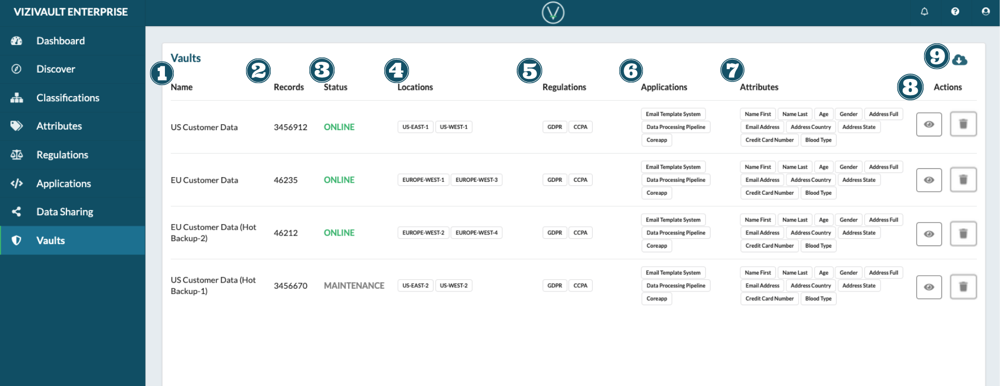

# Vaults

1. **Name**: The unique identifier of the vault.
2. **Records**: Total number of records stored in the vault.
3. **Status**: The current server status. Options are online, offlien, and maintenance.
4. **Locations**: The cloud based server vault locations.
5. **Regulations**: Regulations that apply to the vault and all fo it's stored data.
6. **Applications**: Applications that have access rights to the vault.
7. **Attributes**: The attribute data types that reside on the vault.
8. **Actions**: Actions that you can take on a vault.

&nbsp;&nbsp;&nbsp;&nbsp;

&nbsp;&nbsp;&nbsp;&nbsp;&nbsp; View the properties of a vault.

&nbsp;&nbsp;&nbsp;&nbsp;

&nbsp;&nbsp;&nbsp;&nbsp;&nbsp; Disable or Decomission the Vault

9. **Export**: Export information about all available vaults.

&nbsp;&nbsp;&nbsp;&nbsp;

