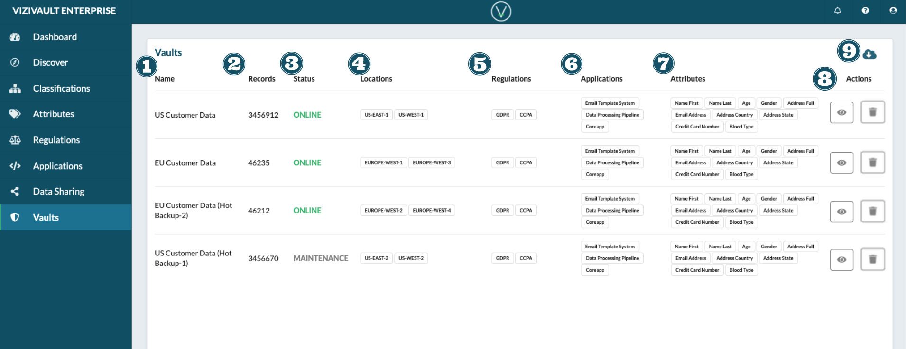

# Vaults

1. **Name**: The unique identifier of the vault.
2. **Records**: Total number of records stored in the vault.
3. **Status**: The current server status. Options are online, offline, and maintenance.
4. **Locations**: The cloud based server vault locations.
5. **Regulations**: Regulations that apply to the vault and all of its stored data.
6. **Applications**: Applications that have access rights to the vault.
7. **Attributes**: The attribute data types that reside on the vault.
8. **Actions**: Actions that you can take on a vault. 
     View the properties of a vault. 
     Disable or Decomission the Vault.
9. **Export**: Export information about all available vaults. 
    

